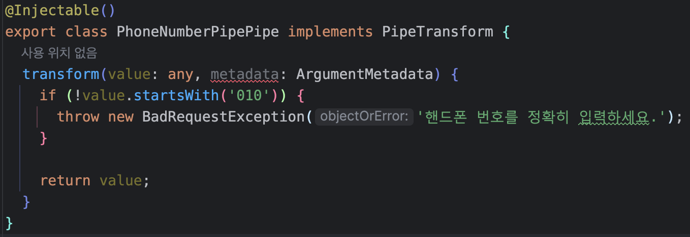

<p align="center">
  <a href="http://nestjs.com/" target="blank"></a>
</p>

## Installation

```bash
$ yarn install
```

## Running the app

```bash
# development
$ yarn run start

# watch mode
$ yarn run start:dev

# production mode
$ yarn run start:prod
```

## Test

```bash
# unit tests
$ yarn run test

# e2e tests
$ yarn run test:e2e

# test coverage
$ yarn run test:cov
```

***

## 개발 가이드

### 파일 이름

#### 정의

> 이름.타입.ts
>
> 모든 이름은 소문자 단수로 작성
>
> 이름이 복수의 단어로 조합 됐을 경우 Kebab case

#### 예시

> user.controller.ts
>
> user.service.ts
>
> lesson-type.enum.ts

***

### 클래스 이름

#### 정의

> 이름+타입 Pascal case

#### 예시

> UserController
>
> UserEntity

***

### 폴더 구조

#### 정의

- 도메인별로 resource를 구분해서 유지
    - ex) user, lesson, ...
- 도메인의 module 파일은 도메인 루트 경로에 유지

#### 폴더 이름

##### 정의

> 모든 이름은 소문자 단수로 작성
>
> 도메인 폴더 하위에 역할에 따라서 폴더 생성 후 구분
>
> 이름이 복수의 단어로 조합 됐을 경우 Kebab case

##### 예시

> user
>
>> controller
>
>> entity
>
>> service
>
>> repository
>
>> user.module.ts

> lesson
>
>> controller
>
>> entity
>
>> service
>
>> repository
>
>> lesson.module.ts


***

### 환경 변수 관리

#### 패키지 설치

```shell
yarn add @nestjs/config
```

- .env 파일에 작성해서 관리
- .env.example에 필요한 환경변수 등록해서 관리

#### 사용법

```typescript
process.env[ENV_KEY]
```

***

### ORM

- 기본적으로 TypeORM 사용
  - 일부 도메인은 Supabase 사용

#### 패키지 설치

```shell
yarn add @nestjs/typeorm typeorm pg
```


***

### 구조 및 역할

> controller - service - repository

#### Controller

- 요청 및 응답의 데이터 구조 정의
- 입력 유효성 검사
  - ex) 수업을 시작할 때 진행하려고 하는 수업의 종류를 전달 했는지 여부
- **간단한 조회라도 `Service`에 요청해서 처리**
- REST API를 규칙을 준수하도록 최대한 노력해서 URI 작성
  - 자원에 해당하는 URI를 복수로 작성
    - `HOST/users`
  - HTTP Method를 준수(GET, POST, PATCH, DELETE)

#### Service

- 비즈니스 유효성 검사
  - ex) 수업을 시작할 때 유효한 수강권이 있는지 확인
  - 비즈니스 규칙에 맞지 않을 경우 exception으로 처리
- DB 처리가 필요한 로직은 `Repository`에 요청
- TypeORM의 Repository를 바로 주입 받지 않고 직접 생성한 Repository를 DI 받는다
- 

#### Repository

- 모든 DB의 CRUD를 담당
- TypeORM이나 Supabase 등 상황에 따라서 사용할 기술의 DI를 받는다
- 
- 

#### Entity

- **테이블 이름은 복수로 설정**
- **컬럼 이름은 Snake case로 설정**
  - 프로퍼티는 Camel case
- 지정된 값의 목록이 있을 경우 enum을 활용
- relation을 지정할 때 무조건 반대편 모델에도 relatation을 추가하지 않고 반대편에서도 이 모델을 알아야 되는지 생각해보고 추가
- 

***


#### Pipe

##### 용도

- Validation
  - 
  - 

- 파라미터 형변환
  - `ParseIntPipe`, `ParseBoolPipe`, .....
  - 

- 기본값 정의
  - 

#### Guard

- 요청 처리 권한 확인
  - 
  - 
- request 객체에 데이터 전달
  - 
